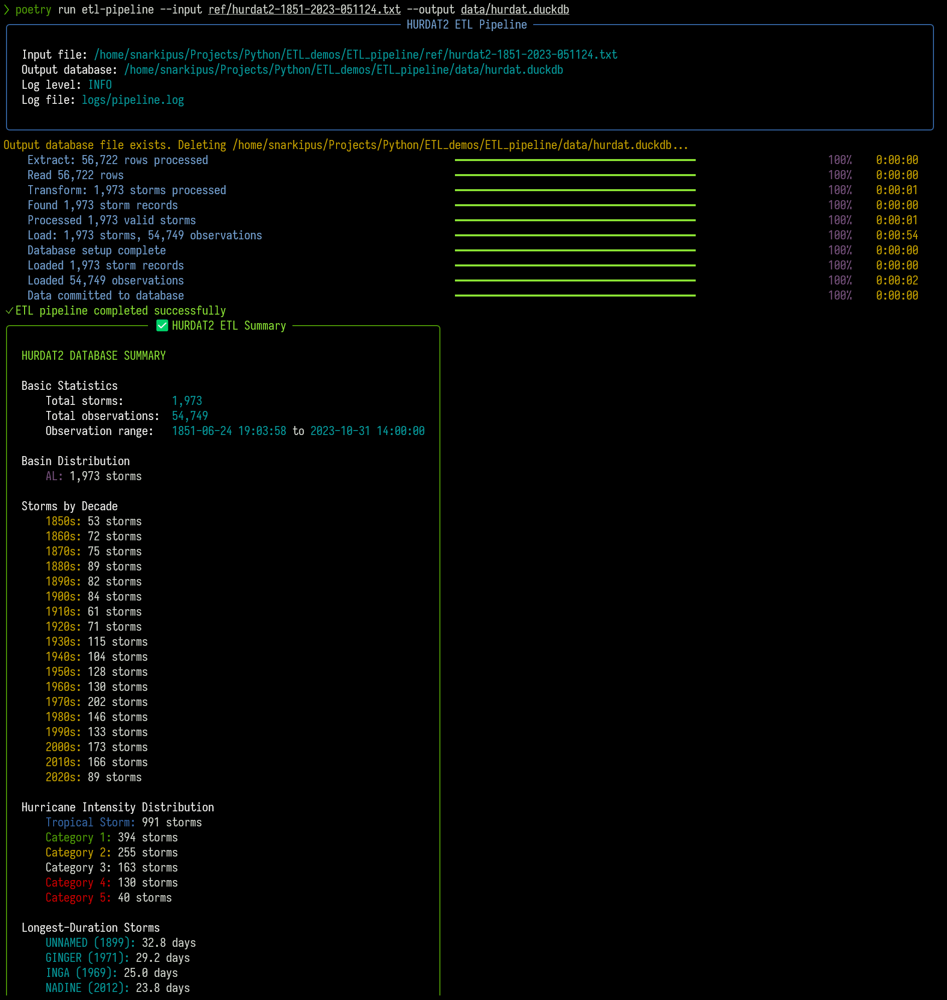
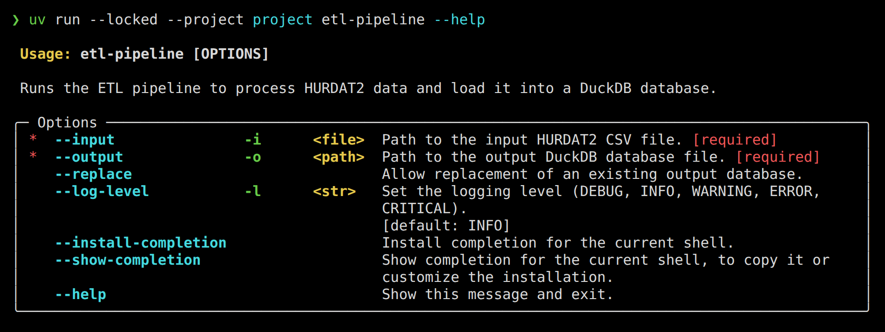

# HURDAT2 ETL Pipeline

[](https://www.python.org/downloads/)
[](LICENSE)
[](https://github.com/astral-sh/ruff)
[](https://mypy.readthedocs.io/en/stable/)

A modern ETL (Extract, Transform, Load) pipeline for processing HURDAT2 hurricane track data into a structured DuckDB database.



## Overview

This project implements a complete ETL pipeline for the [HURDAT2 dataset](https://www.nhc.noaa.gov/data/#hurdat), the National Hurricane Center's Atlantic hurricane database. The pipeline:

1. **Extracts** raw data from HURDAT2 text files
2. **Transforms** it into structured, validated data models
3. **Loads** it into a DuckDB database for easy querying

The implementation follows modern software engineering practices, including clean architecture principles, domain-driven design, comprehensive test coverage, and strong type safety.

## Features

- **Clean Architecture**: Separation of concerns with distinct Extract, Transform, and Load stages
- **Rich Progress UI**: Dynamic progress tracking with color-coded status indicators
- **Statistical Analysis**: Comprehensive summary of processed hurricane data
- **Robust Error Handling**: Custom exception hierarchy and detailed error reporting
- **Comprehensive Tests**: 80%+ code coverage with unit and integration tests
- **Type Safety**: Fully type-annotated with mypy validation
- **DuckDB Integration**: Fast, efficient geospatial querying capabilities
- **Detailed Logging**: Structured logging throughout the pipeline

## Installation

### Prerequisites

- Python >=3.13,<4 (development pin: 3.13)
- [uv](https://docs.astral.sh/uv/getting-started/installation/) (validated with 0.12.10)

### Setup

1. Clone the repository:
   ```bash
   git clone https://github.com/yourusername/etl_pipeline.git
   cd etl_pipeline
   ```

2. Install the pinned Python and locked project/development dependencies:
   ```bash
   uv python install 3.13
   uv sync --locked
   ```

   `uv sync --locked` uses `.python-version` and refuses an out-of-date `uv.lock`
   instead of updating dependency selections. Generate dependency changes with
   `uv lock`; never hand-edit the lockfile. Poetry is not required.

## Usage

Run the ETL pipeline with:

```bash
uv run --locked etl-pipeline --input /path/to/hurdat2.txt --output /path/to/database.duckdb
```

Options:
- `--input`, `-i`: Path to the input HURDAT2 text file (required)
- `--output`, `-o`: Path to the output DuckDB database file (required)
- `--replace`: Explicitly allow atomic replacement of existing output. The CLI
  builds and verifies a sibling candidate before publication; keep external
  writers stopped. Publication failure retains the candidate at the reported
  path for manual recovery, without changing old output. Supported local
  filesystems must provide atomic replace/hard-link operations; no copy fallback
  or automatic backup is provided.
- `--log-level`, `-l`: Logging level (defaults to INFO)



## Project Structure

```
etl_pipeline/
├── data/                  # Default directory for storing output data (e.g., DuckDB file)
├── docs/                  # Workflow guide, README assets, and historical archive
├── openspec/              # Accepted specifications and proposed changes
├── ref/                   # Reference materials (e.g., data format specs, source data files)
├── src/                   # Main source code directory
│   └── etl_pipeline/      # Core package for the ETL pipeline
│       ├── extract/       # Modules for extracting data from the source (HURDAT2)
│       ├── load/          # Modules for loading transformed data into the target (DuckDB)
│       ├── migrations/    # Database schema migration scripts (Alembic)
│       ├── transform/     # Modules for transforming and validating extracted data
│       ├── utils/         # Shared utility functions and classes
│       ├── cli.py         # Command-line interface logic (using Typer)
│       ├── core.py        # Core application logic, orchestration, and shared components
│       └── exceptions.py  # Custom exception classes for the pipeline
└── tests/                 # Test suite for the project
    ├── integration/       # Integration tests (testing component interactions)
    └── unit/              # Unit tests (testing individual modules/functions)
```

## Architecture

The ETL pipeline follows a three-stage architecture:

1. **Extract Stage**:
   - Processes the raw HURDAT2 text file
   - Yields rows of raw string data

2. **Transform Stage**:
   - Parses raw data into structured objects
   - Validates data using Pydantic models
   - Handles anomalies and edge cases

3. **Load Stage**:
   - Sets up DuckDB with spatial extensions
   - Implements the Repository pattern
   - Uses Unit of Work pattern for database transactions

## Statistical Insights

The ETL process generates a comprehensive summary report, including:

- Total storms and observations processed
- Full date range of the dataset
- Hurricane categorization by intensity
- Decade-by-decade distribution of hurricane activity
- Longest-duration storms in the record

## Development

See the [documentation map](docs/README.md) and
[agentic workflow](docs/agentic-workflow.md) before starting a change.
OpenSpec owns specification and intent; Beads drives implementation, with
`tasks.md` reconciled continuously from verified outcomes. Historical plans and
diagrams are retained in the [documentation archive](docs/archive/README.md),
not treated as accepted requirements or an active backlog.

### Testing

Run tests with pytest:

```bash
uv run --locked pytest              # Full suite, branch coverage, 80% minimum
uv run --locked pytest --no-cov tests/unit/transform/test_parser.py  # Focused only
```

### Type Checking

Run mypy type checking:

```bash
uv run --locked mypy src tests
```

### Linting

Run ruff linter:

```bash
uv run --locked ruff check src tests
uv run --locked ruff format --check src tests
```

Use `uv run --locked ruff format src tests` to apply formatting. Mypy and the
existing remote Ruff/mypy hook versions remain in use during this baseline
increment; hook alignment and known source lint cleanup are separate work.

## License

This project is licensed under the MIT License - see the LICENSE file for details.

## Acknowledgments

- [HURDAT2 Dataset](https://www.nhc.noaa.gov/data/#hurdat) from the National Hurricane Center
- [DuckDB](https://duckdb.org/) for the embedded database
